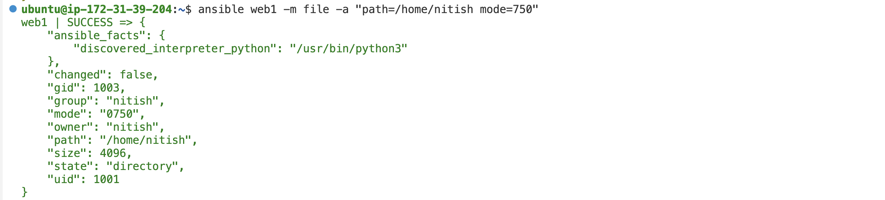

ANSIBLE ASSIGNMENT-1

Complete the following steps with the help of ansible modules:

UserManager:

Add NinjaTeam (Simulate Group) ex: team1 
------->>>>>>>   ansible web1 -m group -a "name=team1 state=present" -b  <<<<<<<----------

------->>>>>>>   ansible web1 -m group -a "name=batch28 state=present" -b  <<<<<<<----------

Add a User (Simulate) under a team ex: Nitish added to team1 Ensure below constraints are met: 
------->>>>>>>   ansible web1 -m user -a "name=nitish state=present groups=team1,batch28" -b  <<<<<<<------

A user should have read,write, execute access to home directory 
All the users of same team should have read and excute access to home directory of fellow team members.

------->>>>>>>  ansible web1 -m file -a "path=/home/nitish mode=750" -b  <<<<<<<---------

In home directory of every user there should be 2 shared directories

Team: Same team members will have full access 
----->>>>>>>  ansible web1 -m file -a "path=/home/nitish/team state=directory mode=770 owner=nitish group=team1" -b  <<<<<<<----

Ninja: All ninja's will have full access 
------->>>>>>>  ansible web1 -m file -a "path=/home/nitish/Ninja state=directory mode=777 owner=nitish group=batch28" -b  <<<<<<<----------

Additional Features:

Change user Shell 
------->>>>>>>  ansible web1 -m user -a "name=nitish shell=/bin/bash" -b  <<<<<<<----------

Change user password 
----->>>>> ansible web1 -m user -a 'name=nitish state=present password="{{ "nitish01234" | password_hash("sha512") }}"' -b   <<<<<<-----

Delete user 
------->>>>>>>  ansible web1 -m user -a "name=nitish state=absent " -b  <<<<<<<----------

Delete Group 
------->>>>>>>  ansible web1 -m group -a "name=team1 state=absent" -b  <<<<<<<----------

List user or Team  
------->>>>>>>  ansible web1 -m command -a "cat /etc/passwd" <<<<<<<----------

------->>>>>>>  ansible web1 -m command -a "cat /etc/group"  <<<<<<<----------
