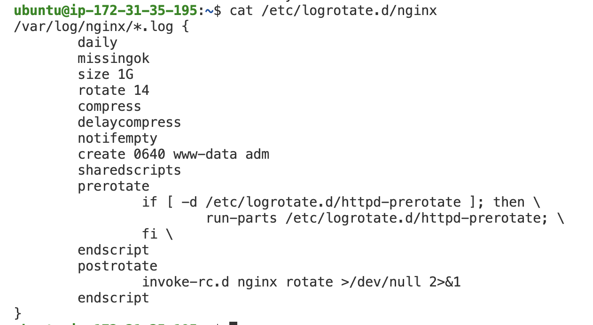
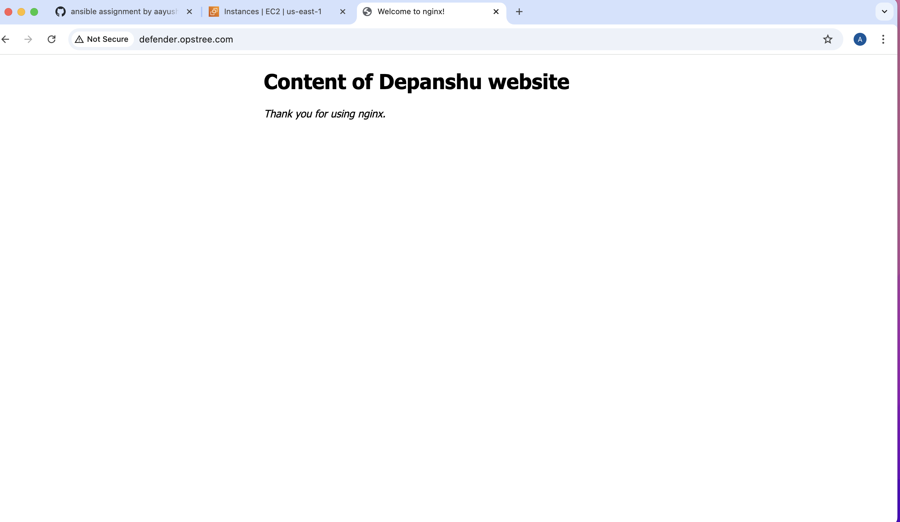
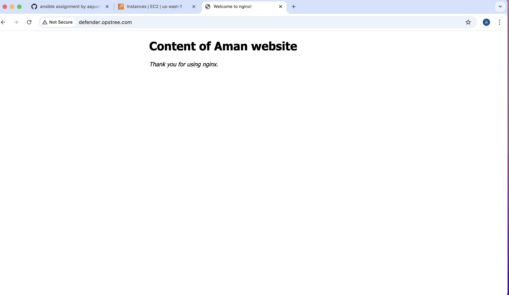
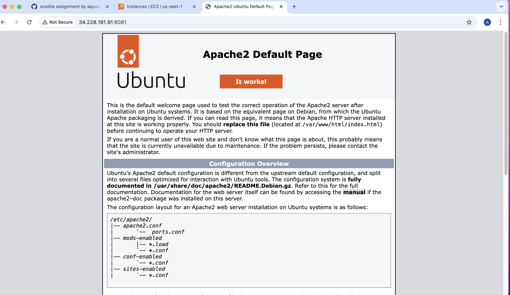
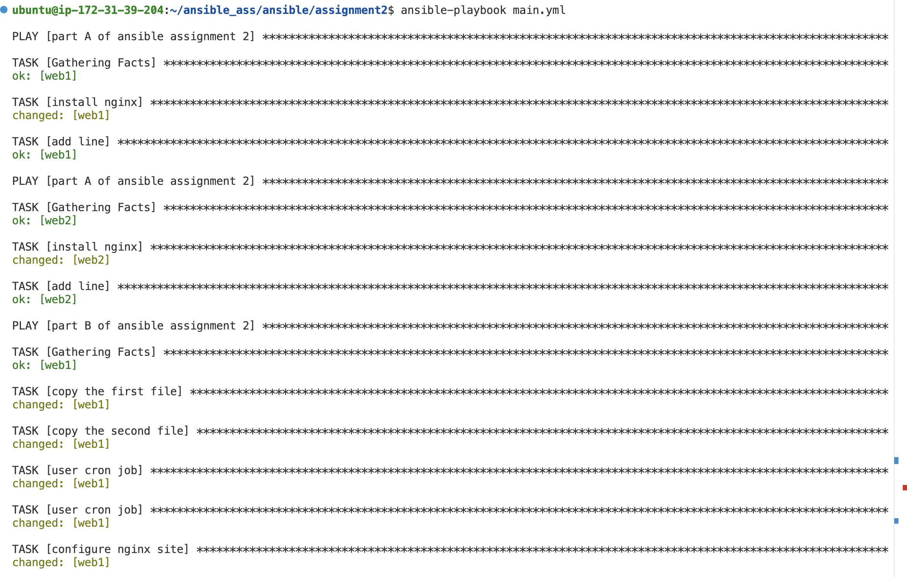
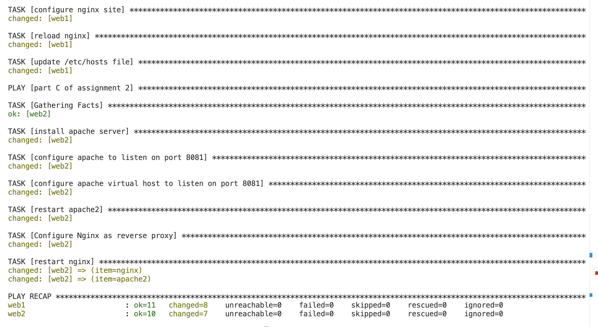

Ansible Assignment-2

Install nginx in your servers(more then 2) and make sure the log files of nginx should not be granted more than 1 GB space on the nodes 

Create equal number of websites as per your team  members and every members website should be hosted for only 2 hours and after every 2 hours another website should start displaying.

    - First 2 hours <team>.opstree.com should display content of tanya website

    - Next 2 hours <team>.opstree.com should display content of Heena website

Install Apache
Also Configure nginx to run as reverse proxy to apache after completing first point individually.

- Run the ansible commands in such a way that workers nodes are updated one by one and not altogether and also make sure using all type of strategies.

playbook command output
 