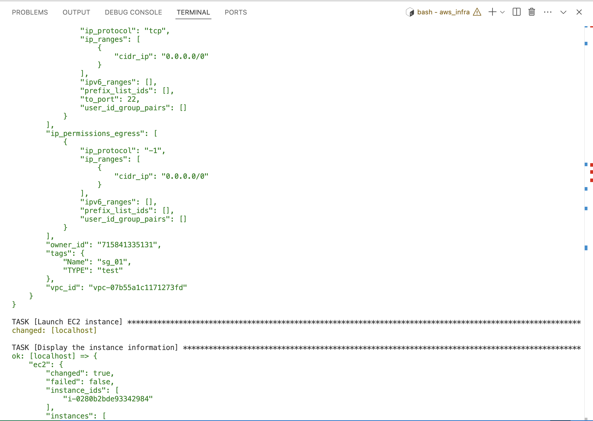
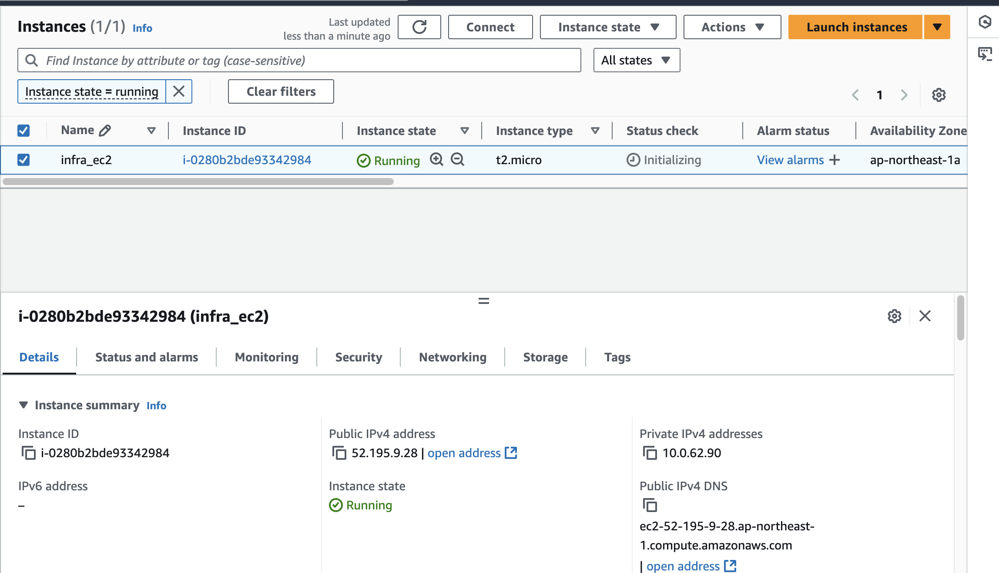

Ansile Assignment-3

Setup an entire infra using ansible playbook on aws

Setup Spring3HibernateApp (https://github.com/opstree/spring3hibernate) on created infra using ansible playbook by following the below steps:

Install MySQL 

Create the war file for Spring3HibernateApp using maven

Install JDK 11 

Install Tomcat

Send the war file created earlier to path "/opt/tomcat/apache-tomcat-7.0.108/webapps/"
  

Restart tomcat service

opstree/spring3hibernate

A java loaded application for various testing purpose Website

command output
